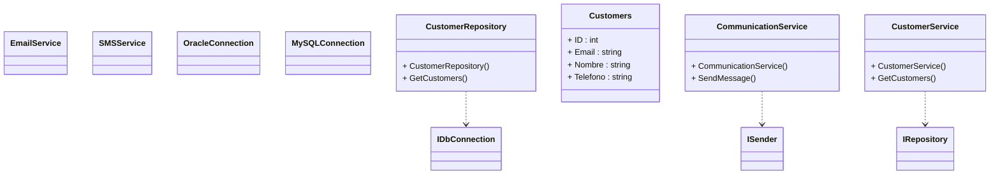

```mermaid
classDiagram
class EmailService
class SMSService
class OracleConnection
class MySQLConnection
class CustomerRepository{
    + CustomerRepository()
    + GetCustomers()
}
class Customers{
    + ID : int
    + Email : string
    + Nombre : string
    + Telefono : string
}
class CommunicationService{
    + CommunicationService()
    + SendMessage()
}
class CustomerService{
    + CustomerService()
    + GetCustomers()
}
class ISender
class IRepository
class IDbConnection

CommunicationService ..> ISender

CustomerService ..> IRepository

CustomerRepository ..> IDbConnection
```